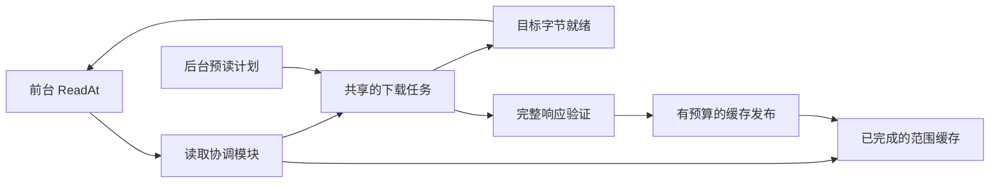

# 网络文件系统客户端对 mount123 的设计启发

调研日期：2026-10-08。项目基线：`9c45121af4a17a3b0ca234b5a01e230c6948aba5`。三个研究 agent 分别检查 NFS、SMB/Samba、对象存储客户端，主 agent 对照当前代码复核。本文是设计评估，没有修改挂载实现、调整运行参数或执行新的性能基准。

结论：现有按需读取、范围共享、版本化缓存、前台保留槽和渐进解压方向合理。下一轮最有价值的是缩短前台等待、统一全局资源预算，以及用实际消费反馈控制预读。NFS/SMB 的服务器租约和写回协议不是当前 HTTP 只读后端的必要组成。

## 查阅范围与版本

| 对象 | 检查依据 | 对应关注点 |
| --- | --- | --- |
| Linux NFS/SunRPC | 主线 commit `0c2669a9f4a1d607e7591ae50ccf3c432a0aff08`，提交时间 2026-10-08 04:44 UTC；与 v6.12 对照 | 页缓存、批量读取、目录属性回填、RPC 排队 |
| Linux netfs | 调研日官方文档；内核实现随版本变化 | 读取子请求、渐进完成、后台本地缓存写入 |
| SMB2/3 | Microsoft Open Specifications；与上表相同主线 SHA 的 Linux SMB 客户端源码 | 按请求大小计费的 credits、异步请求、lease |
| Samba | 当前 smbclient 手册；Samba 4.22.0 libsmbclient 接口源码 | 区分内核挂载、命令行客户端与应用库 |
| rclone | v1.75.1 源码及当前 mount 文档 | 请求大小与并行流分别控制、稀疏缓存 |
| Mountpoint for S3 | `mountpoint-s3-1.23.0` 官方配置文档 | 全进程吞吐目标、按内存余量调整预读 |
| JuiceFS | v1.4.0 官方缓存文档 | 顺序预读、随机预取和选择性磁盘缓存 |
| go-fuse | 项目实际依赖 v2.11.0 的本地源码 | READDIRPLUS、FileLookuper、内核页缓存 |

固定版本用于复查，不意味着这些标签都是各项目当前最新版本。

## 已有能力与真实缺口

| 方面 | 当前实现 | 值得增加的部分 |
| --- | --- | --- |
| 数据共享 | 元数据、正文、预读共享范围片段；重叠下载合并 | 共享正在下载的可读前缀，避免整段完成后才交付 |
| 调度 | 全局下载 8 槽、构建 4 槽，后台分别最多 7/3；前台排队优先 | 全局在途字节、待缓存字节预算；同一后台任务被前台需要时提升优先级 |
| 预读 | 每句柄 1→4→16 MiB，最多两个在途预读；图片按方向最多 9 张 | 按消费速率、等待、命中率调整；跟踪已消费、已完成、在途位置 |
| 缓存 | 磁盘 LRU、durable/ephemeral、版本化索引、完整成员发布 | 区分实际读过与仅推测会读的数据，减少一次扫描淘汰热点 |
| 目录 | 完整云目录快照、直接成员查找；RAR 每次打开冻结已发现项 | 目录句柄直接用冻结快照完成 READDIRPLUS Lookup |
| 内核缓存 | 完整成员可缓存；普通文件/Store/进行中的解压保持 DIRECT_IO | 在明确版本快照和预取信号后，评估普通文件/Store 的可选页缓存 |

对应实现：[范围缓存](../../mount123/internal/storage/range_cache.go)、[远端读取](../../mount123/internal/storage/remote.go)、[调度](../../mount123/internal/workqueue/gate.go)、[顺序预读](../../mount123/internal/mountfs/read_ahead.go)、[图片预取](../../mount123/internal/mountfs/prefetch.go)、[RAR 目录快照](../../mount123/internal/mountfs/progressive_archive.go)。

## P1：把“数据可读”和“缓存已持久化”分开

Linux netfs 将读取拆成来自服务器或缓存的子请求，允许渐进完成；本地缓存写入可在之后进行。这说明前台交付不必与整次下载、本地缓存写入共用一个完成点。它是内核模块接口，Go 程序借鉴其设计即可。[Linux netfs：Result Collection / Local Caching](https://docs.kernel.org/filesystems/netfs_library.html)

当前代码存在明确的串行等待条件：`beginRangeFlight()` 遇到任何重叠区间都等待已有 flight 的 `done`；`Cache.fill()` 要等待整个 Range 接收完成，durable 模式还要 `Sync`、关闭和原子重命名，才发布可读缓存。因此前台只需要一个 64 KiB 片段时，也可能等待与它重叠的 16 MiB 预读完成。这是源码确认的行为，尚未测量它在真实工作负载中的占比。归档成员已有 growing 机制，但原始 HTTP 范围仍走完整发布。

建议在现有 storage 模块内部增加“下载中区间”的可读进度：

- 同一实体的一个 HTTP Range 仍可很大，但按较小单元通知读者哪些字节已到达；前台等待目标区间即可。
- 下载中缓冲采用有界页池或暂存文件，不另外建立无限增长的 Go 热数据副本；已完成文件仍利用本地文件的 OS 页缓存。
- 接收完成且验证通过后再原子发布持久缓存；异步缓存写入要有全局预算和背压，不能把磁盘压力改成无限内存排队。
- 前台读者持有共享任务引用；取消预测窗口不能中止仍被前台需要的下载。当前已有的解压任务引用规则可以复用思想。
- 保留版本条件、Content-Range 和长度检查。提前交付的字节不能撤回；随后短响应须使后续读取失败，不能把不完整范围标记为完整。加密/压缩成员末尾等待最终校验的现有规则继续保留。

验收：模拟服务器先发目标前缀、阻塞 Range 后半段；前台小读必须先完成，持久完整缓存此时不可见。再验证断流、版本变化、取消一个读者、多读者复用，以及故意减慢磁盘发布时前台交付是否仍可推进。先消除这类等待，再扩大请求尺寸，避免大块下载放大交互延迟。

## P1：全局字节预算与任务提升

SMB2/3 的 multi-credit 请求按发送或预期响应大小计算 CreditCharge，协议单位为 64 KiB，额度由服务器授予。可借鉴“大请求消耗更多资源”这一原则；HTTP 侧应自行管理本地预算，不能套用 SMB 服务端授予规则或直接照搬其单位。[Microsoft CreditCharge 规范](https://learn.microsoft.com/en-us/openspecs/windows_protocols/ms-smb2/18183100-026a-46e1-87a4-46013d534b9c)

Mountpoint 对所有文件共享吞吐目标，并按可用内存调整各句柄预读窗口。我们当前传输以流式写盘为主，因此需要分别记账“网络请求尚未完成的字节”“缓冲驻留字节”“等待写入缓存的字节”，三者不能当作同一个 RAM 数值。[Mountpoint 1.23.0 配置：performance / prefetch window](https://github.com/awslabs/mountpoint-s3/blob/mountpoint-s3-1.23.0/doc/CONFIGURATION.md)

当前 Linux SMB 的 `cifs_prepare_read()` 先取得可用 credits 并确定子请求长度，`cifs_issue_read()` 再调整额度、处理失效句柄并发出异步读；它已接入 netfs 的请求结构。具体可借鉴的是在发出传输前协商资源和请求尺寸，而不是照旧版客户端重新组织一套独立页读取流程。[当前 SMB file.c](https://github.com/torvalds/linux/blob/0c2669a9f4a1d607e7591ae50ccf3c432a0aff08/fs/smb/client/file.c)、[当前 SMB credit 实现](https://github.com/torvalds/linux/blob/0c2669a9f4a1d607e7591ae50ccf3c432a0aff08/fs/smb/client/smb2ops.c)

建议保留现有请求数上限，再加入共享字节额度，覆盖顺序预读、图片预取和归档扫描的下载。单独保护前台额度，同时按文件公平调度，避免一个视频或大型扫描持续占满后台。归档解压后的目标大小与实际压缩输入量分别统计，不能用图片大小推算固实 RAR 的全部成本。

前台命中已有后台任务时，应提升该任务的有效优先级和后续子请求优先级；不重复下载，也不为了腾槽取消前台正需要的任务。已经开始的 HTTP 请求无法靠队列优先级立刻变快，保证主要作用于下一批请求及背压分配。不要把字节额度当作带宽整形器；若需要固定下载速率，那是另一种控制。

验收：1/4/16 个文件混合顺序读，加一个周期性小文件读取；观察全局在途量、前台 P95/P99 等待和后台饥饿。加入某个前台等待者退出的测试，验证另一等待者仍可继续。预算范围先做实验，不在未测量前确定新默认值。

## P1：由消费进度和命中反馈驱动预读

NFS 的 `nfs_readahead()` 把页读取交给 pageio 聚合；SunRPC 有请求槽和 backlog。rclone 则把单流逐步扩大的块和多流固定块区分为两种策略。两者都值得用于区分“每次请求多大”与“保持多少请求在途”，不能只增加一个数字。[当前 NFS read.c](https://github.com/torvalds/linux/blob/0c2669a9f4a1d607e7591ae50ccf3c432a0aff08/fs/nfs/read.c)、[当前 SunRPC xprt.c](https://github.com/torvalds/linux/blob/0c2669a9f4a1d607e7591ae50ccf3c432a0aff08/net/sunrpc/xprt.c)、[rclone VFS chunked reading](https://rclone.org/commands/rclone_mount/#vfs-chunked-reading)

我们的 `readAhead.observe()` 每次成功 Read 都可能从 `plannedUntil` 继续追加一个窗口；当前限制的是同时下载数量/字节，没有直接限制已完成但尚未消费的数据距读取位置有多远。在网络快于应用消费时，这与“始终只提前两块”并不等价。失败请求也不会主动回退 `plannedUntil`，后续前台仍可补读，但预测状态不代表成功缓存进度。

建议显式跟踪消费位置、连续就绪位置、在途区间；仅当消费接近预读前沿时续填。乱序或重叠的 FUSE 请求不应仅因 `off != previousEnd` 就一律判定用户跳转；需要区分真正 seek、小范围回看和并发请求完成顺序。

窗口依据最近消费速度、请求启动等待、命中率和全局余量调整：连续消费快且等待多时扩大；随机访问、低命中、前台排队或磁盘拥塞时收缩。例子：用户给出的 250 MB/s，若假设 RTT 为 50 ms，带宽时延积约 12.5 MB；这是容量估算，非现场测量，也不能证明默认两个 16 MiB 窗口不足。RTT、HTTP 首字节等待和完整请求耗时应分别记录。

验收包括：慢消费者+快网络的超前字节上限；快速连续读能保持流水线；失败后重新规划；正反向图片与随机 seek；同句柄重叠/乱序读取。以有效交付吞吐和预取浪费共同判断收益。

## P2：缓存准入与热点保护

JuiceFS 区分顺序 readahead 和随机小读后的整块 prefetch，也提供仅缓存部分读取的模式，适用于远端吞吐高于本地缓存盘的情况。这说明“下载过”不必等同于“应长期保留”。[JuiceFS v1.4.0 缓存指南](https://github.com/juicedata/juicefs/blob/v1.4.0/docs/en/guide/cache.md)

当前完成的预测数据与被用户读过的数据进入相同磁盘 LRU，索引 DTO 也共用预算。建议先试两级队列：仅预测数据进入可优先淘汰队列，实际命中后提升；对小型已完成索引保留有限的保护预算。每个文件的长期缓存份额也应有软约束，避免扫一个大 RAR 淘汰全部常用成员。默认仍保持持久缓存；只有确认磁盘写入是瓶颈后，再实验一次性大顺序读不落盘等策略。

`ephemeral` 只是跳过同步和跨挂载复用，仍然写文件，不能算“不落盘模式”。也不宜直接加一套大容量 Go 热缓存：本地缓存文件已可命中 OS 页缓存。P1 所需的短期下载缓冲与额外长期 LRU 是两件事。

验收：预热一组小图和归档索引，再扫描一个超过缓存预算的大文件，比较热点留存、二次打开延迟、写盘字节和前台命中率。

## P2：目录句柄直接复用快照

NFSv3 READDIRPLUS 在目录项中附带属性和句柄，NFSv4 的 READDIR 使用属性请求；Linux 客户端会根据访问情况选择是否多取属性。这是协议设计背景。[RFC 1813 §3.3.17](https://www.rfc-editor.org/rfc/rfc1813.html#section-3.3.17)、[当前 NFS dir.c](https://github.com/torvalds/linux/blob/0c2669a9f4a1d607e7591ae50ccf3c432a0aff08/fs/nfs/dir.c)

go-fuse v2.11.0 已默认支持 READDIRPLUS，并在 `readDirMaybeLookup()` 内补 Lookup；没有必要再做“打开 READDIRPLUS”功能。它也提供目录句柄 `FileLookuper` 接口，允许直接从最后列出的项返回 inode/属性。[go-fuse bridge.go](https://github.com/hanwen/go-fuse/blob/v2.11.0/fs/bridge.go)、[FileLookuper 接口](https://github.com/hanwen/go-fuse/blob/v2.11.0/fs/api.go)

当前 `OpendirHandle()` 返回名称/类型流，RAR 已冻结当时发现项；READDIRPLUS 补属性时仍会进入节点 Lookup。可让目录句柄同时保留有预算的元数据快照，用同一快照返回属性和稳定 inode；减少重复来源/密码/索引查找和锁开销，并避免列表与附带属性来自两次不同刷新。不要让每个句柄复制整个全包索引。

云 List 本来就带大小、时间等信息，已有共享快照；因此这项不是减少 N 次云端请求，也不建议默认打开额外 Infos。RAR 的部分目录快照语义继续保持，完整遍历仍先 `wait-index`。

验收：1k/10k 项目录比较 `ls -l`、`find` 的 FUSE 调用、内部 Lookup 路径次数与 CPU；同时测试目录刷新和 RAR 扫描新增时同句柄结果稳定。

## 可选实验：更多内核页缓存与有限重试

FUSE DIRECT_IO 绕过挂载文件的内核页缓存和内核预读；cached 模式可以复用这些能力。注意挂载文件的 FUSE 页缓存与本地缓存文件的 OS 页缓存不同：目前普通/Store 路径前者关闭，后者仍可用。[Linux FUSE I/O modes](https://docs.kernel.org/filesystems/fuse/fuse-io.html)

在本项目明确的不可变内容版本下，可实验让普通文件与 Store 使用 cached 模式，并减少重复的用户态预读。前提是 inode 标识包含内容版本、旧句柄保持快照，且新打开仍执行当前密码/身份检查。图片预取目前靠 Read 回调推断方向，内核命中可能不再触发回调；没有替代信号前不应全局移除 DIRECT_IO。先用普通大文件试验，检查重复读、mmap、版本替换和额外内存占用。

HTTP Range 的 URL 失效刷新已经存在，通用瞬时网络错误/429/503 有界重试仍可改进。可以在同一内容版本和区间内退避重试，遵守总时间/尝试次数和取消；如断流时安全保留已收到前缀，可只重试缺失后缀。不得把旧、新版本拼起来，也不得因两套重试嵌套而指数放大请求。前述 netfs 的子请求重试是一种设计参考；NFS hard mount 无限重试不是交互浏览的理想默认。

## 不建议直接引入的机制

- **SMB lease / NFS delegation**：依赖服务器授予和召回，长期直链不是租约。只读挂载也不等于云端命名空间不会被其他客户端改变。[SMB lease break](https://learn.microsoft.com/en-us/openspecs/windows_protocols/ms-smb2/4f35576a-6f3b-40f0-a832-1c30b0afccb3)、[NFSv4 delegation](https://www.rfc-editor.org/rfc/rfc7530.html#section-10.4)
- **SMB multichannel / durable handle**：不能把 SMB 会话控制移植到 API 下载 URL；多 HTTP 连接与 SMB 多通道不是同一功能。[SMB2/3 协议概览](https://learn.microsoft.com/en-us/openspecs/windows_protocols/ms-smb2/4287490c-602c-41c0-a23e-140a1f137832)
- **把 Samba 当作通用挂载后端**：Linux CIFS 是内核客户端，Samba smbclient 是命令行工具，libsmbclient 是 SMB 应用库；它们不能直接替换 123 API/归档读取。[smbclient](https://www.samba.org/samba/docs/current/man-html/smbclient.1.html)、[libsmbclient 接口源码](https://github.com/samba-team/samba/blob/samba-4.22.0/source3/include/libsmbclient.h)
- **FS-Cache 再叠一层**：现有持久范围缓存已经承担类似数据保存职责；内核 FS-Cache 也不是 Go 可直接调用的缓存库。优先改善现有路径。[FS-Cache 文档](https://docs.kernel.org/filesystems/caching/fscache.html)

## 实施顺序与测量

先用最小指标把 HTTP 排队、首字节、传输、缓存同步和 FUSE 返回分别计时，再做 P1 的小读提前交付与共享预算。接着调整预读控制器；P2 的缓存准入和目录快照可以独立推进。普通文件页缓存、范围索引结构/锁拆分属于后续按 profiler 结果决定的优化，不在本轮假设必然有效。

建议使用本地可控 Range 源，测试 5/50/150 ms 延迟和 50/250 MB/s 限速；区分单文件顺序读、多文件混合读、稀疏随机读、图片正反向、大 RAR 扫描。冷缓存、同进程热缓存、重挂载缓存分开记录，校验内容一致。

| 目标 | 必须记录的指标 |
| --- | --- |
| 交互更快 | 前台小读 P50/P95/P99、排队时间、因重叠预取等待的时间 |
| 顺序吞吐 | 应用实际收到的字节/秒、源下载字节/秒、请求大小与数量 |
| 预取有效 | 预测字节中实际被消费的比例、取消后仍下载字节、消费位置之前/之后的缓存量 |
| 全局有界 | 在途请求字节、缓冲驻留、待落盘字节、磁盘 reserved、各文件份额 |
| 缓存省成本 | Range 命中字节、索引恢复命中、fsync/写盘耗时、扫描后的热点留存 |
| 目录更轻 | 云 API 请求数、FUSE 请求数、内部 Lookup 次数、CPU/锁等待分别计数 |

本轮只有文档与源码调研；表内指标、参数范围和收益均是后续实验设计，不是已获得的性能结果。
